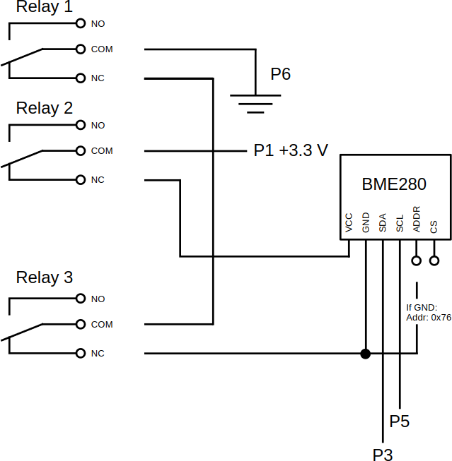

# Data Logger for BME280 Sensors on a Raspberry Pi
#### Video Demo:  <URL HERE>
#### Description:

## 1 Introduction
It is relatively easy to build an environmental data logger on Raspberry Pi computer. Unfortunately there are some challenges that must be resolved, if a robust measuring system is required. The three main problems are: precise timing for measurements, use of multiple environmental sensors on the same computer, and how to recover sensor failures.

This project was coded in Python, and the first challenge was to choose the right function to measure time. Pyhton’s time module provides three time functions: time.time(), time.perf_counter() and time.monotonic(). The time() function is not immune to system clock adjustments and it is also inaccurate. The two latter functions are monotonic increasing time functions, where the time.perf_counter() is more accurate than time.monotonic(). Hence, time.perf_counter was selected for this project.

The sensors used in this project are _Waveshare BME280 Environmental Sensor – Temperature & Humidity & Pressure_. I2C protocol was selected for the communication type. The sensor wiring is shown on the electrical diagram. Two sensors can be connected to the same circuit if their addresses differs. The I2C address can be changed from the default (0x77) by connecting the GND pin to ground, which sets the address to 0x76. A driver that supports reading from a specific I2C address is also needed.

The third problem is hardware related. I2C protocol is meant for short distances, but the measurements requires often extended lengths. The signal is then weakened. It increases the probability of sensor failure. Better cables, signal amplification, etc. can help in this issue, but there is an alternative way how to handle these failures. Rebooting the sensor will initialize it back to normal working mode. The relay can be used to open the electrical circuit and the two relays can be used to open both the +3.3 V VCC and GND circuits, which will turn off the sensor immediately. It has to be shutdown for a small amount of time (0.1 s), then the relays are switched  back to NC (normally closed) position. The circuit is now closed, and a small additional delay (0.1 s) must be given for the sensor in order to boot in normal operation mode.

A third relay can be used for failures simulation. Depending of the driver either VCC or GND must be opened in order to simulate a sensor failure. The wiring diagram for the three relays is shown here:

## 2 Hardware and Operating System
BME280 data logger has following system requirements:
* Raspberry Pi 5 model B 4 GB computer
* Raspberry Pi OS (64-bit): Debian 12 (bookworm)
* One or two Waveshare BME280 Environmental Sensors (Temperature, Humidity, Barometric Pressure)
* Three 5 V or 3.3 V relays for failures simulation, otherwise two relays is enough.
  * Waveshare RPI Relay Board (3 relays) was used in this project.

The data logging system can be installed on a Raspberry Pi 4 computer, if the python3-rpi.gpio module is used instead of rpi-lgpio.

## 3 Python and Required Modules
Python version 3.11.2 has been used in this project. The following list shows the scripts needed to run this program:

**bme280logger.py**

This script is the main program for the data logger.

Non-standard modules:
* bme280.py (driver)
* logfile.py (script)
* relays.py (script)
* board
* Matplotlib
* NumPy

Standard modules:

* argparse
* datetime
* math
* os
* pathlib
* random
* re
* signal
* sys
* time
* threading

**bme280.py**

Driver, with I2C Address port support, for BME280 sensor.

Origin:
[Using the BME280 I2C Temperature and Pressure Sensor in Python 43](https://www.raspberrypi-spy.co.uk/2016/07/using-bme280-i2c-temperature-pressure-sensor-in-python/)

Non-standard modules:
* smbus

Standard modules:
* ctypes
* time

**logfile.py**

DataLog and ErrorLog classes

Standard modules:
* datetime
* os

**relays.py**

Relay class

Non-standard modules:
* RPi.GPIO

## 4 Program Description and Flow

The main program, bm280logger.py should be opened in an environment where the required modules are installed. If the script resides in a path variable, it can be launched from the working directory.

The program is started with the desired arguments, which can be listed with the -h argument:

`BME280 data logger - Kim Miikki 2024`  

`usage: bme280logger.py [-h] [-d D] [-s] [-ts] [-i I] [-nan] [-r R] [-b] [-c]`  
`                       [-a] [-simfail]`  

`options:`  
  
`  -h, --help  show this help message and exit`  
`  -d D        specify file base directory (default = current working`  
`              directory)`  
`  -s          enable datetime subdirectories`  
`  -ts         add timestamp as prefix for files`  
`  -i I        interval in seconds`  
`  -nan        log failed readings as NaN`  
`  -r R        data retention period in memory (default: 7 d)`  
`  -b          create basic graphs`  
`  -c          create graphs of two sensors`  
`  -a          create all graphs`  
`  -simfail    simulate random sensor failures`  

The measurement data is saved in a log file whose name ends with "thp.csv". The desired directory path can be specified with -d argument, subdirectories named 'datetime' can be specified using the -s argument, and the 'datetime' prefix can be optionally added to the log file name with the -ts argument.

The measurement interval is specified with the -s argument, whose unit is seconds. The amount of data to be stored in the memory can be specified with the -d argument, the unit of which is a day. The program limits the number of measurement lines that can be stored in the memory to 60 d measurements at a one-second interval. The limit can be calculated as follows: 3600 * 24 * 60 = 5,184,000 (= rows_limit). The space consumption of two sensors is then 356 MB. If (3600 * 24 * retention_time) / interval > rows_limit, a new retention time is calculated. When the rows_limit value is reached, new measurement data is stored in the memory using the FIFO principle.

Unsuccessful measurements are logged in the error log, but they can be stored as NaN values ​​in the THP log if desired. By default, they are not saved there, but the -nan argument can be used to enable saving.

Arguments -b, -c and -a control whether data graphs are created at the end of the measurements, and which type. The -c option cannot be used with one sensor, because two sensors are needed for combination graphs.

The simulation requires a third relay, through which either the VCC or GND connection to the sensors is cut off, so the sensor can no longer be read.

After starting the program, the necessary Relay classes are created for the control of the power supply of the sensors and the simulation of the error state. After this, it is recognized how many BME280 sensors the program finds. This program requires a minimum of one and a maximum of two BME280 sensors to operate.

