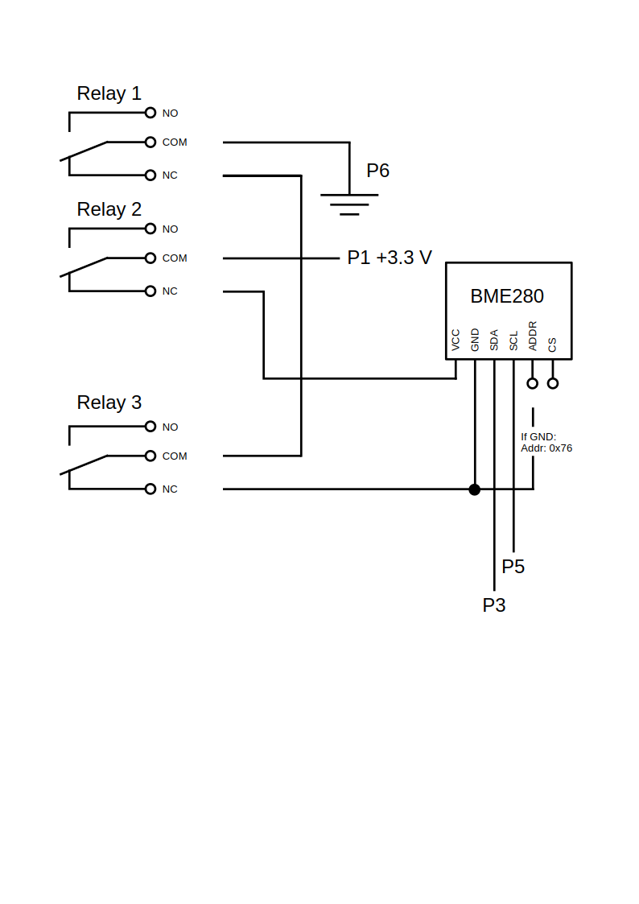

# Data Logger for BME280 Sensors on a Raspberry Pi
#### Video Demo:  <URL HERE>
#### Description:

It is relatively easy to build an environmental data logger on Raspberry Pi computer. Unfortunately there are some challenges that must be resolved, if a robust measuring system is required. Three main problems are: accurate timing for the measurements, use of multiple environmental sensors with the same computer and how to recover sensor failures.

This project was coded with Python, and the first challenge was select a right function for time measurements. Three time functions are provided by time module in Python: time.time(), time.perf_counter() and time.monotonic(). The time() function is not immune to system clock adjustments and it is also inaccurate. The two latter functions are monotonic increasing time functions, where the time.perf_counter() is more accurate than time.monotonic(). Hence time.perf_counter was selected for this project.

The sensors used in this project are _Waveshare BME280 Environmental Sensor – Temperature & Humidity & Pressure_. I2C protocol was selected for the communication type. The sensor wiring is shown on the electrical diagram. Two sensors can be connected in the same circuit, if their addresses differs from each other. The I2C address can be changed from the default (0x77) by connecting the GND pin to ground to address 0x76.

The third problem is hardware related. I2C protocol is meant for short distances, but the measurements requires often extended lengths. The signal is then weakened. It increases the probability of sensor failure. Better cables, signal amplification, etc. can help in this issue, but there is an alternative way how to handle these failures. Rebooting the sensor will initialize it back to normal working mode. A relay can be used to open the electrical circuit, and with two relays both +3.3 V VCC and GND can be opened which shut down the relay. The sensor has two be shutdown for a small amount of time (0.1 s), then the relays are turned back to NC (normally closed) position. The circuit is now closed, and an additional small delay (0.1 s) must be given for the sensor booting to normal operation mode. This procedure recovers a failed sensor back to normal working state.

A third relay can be used for failures simulation. Depending of the driver either VCC or GND must pe opened in order to simulate a sensor failure. An electrical diagram, for three relays, is shown here:                                                 

