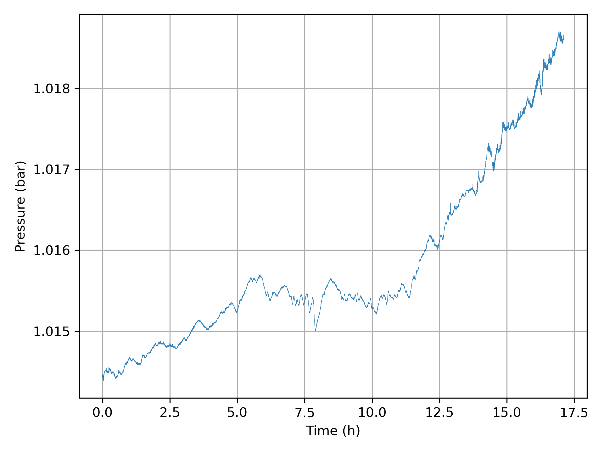
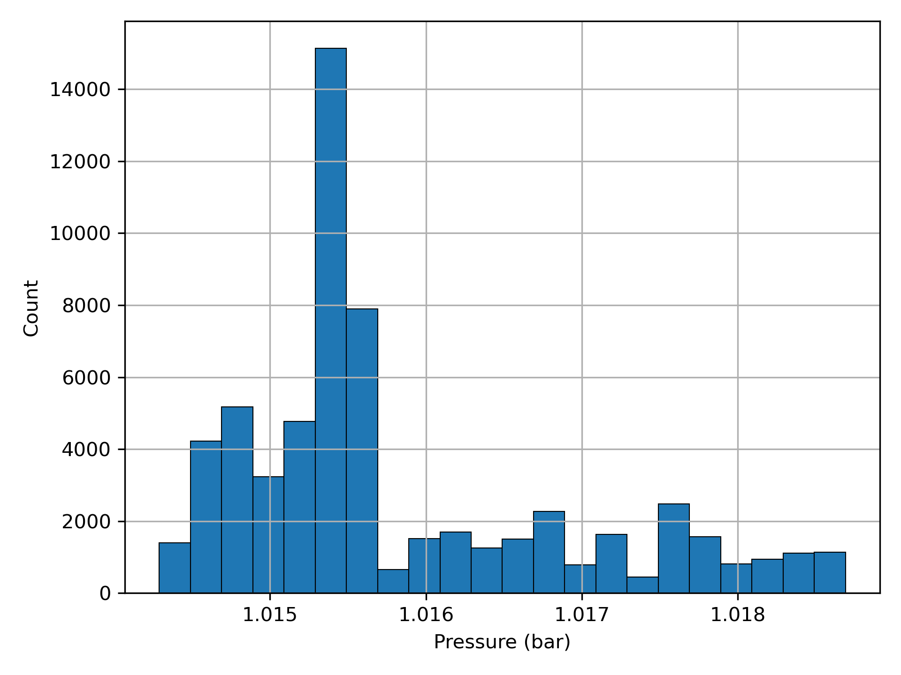
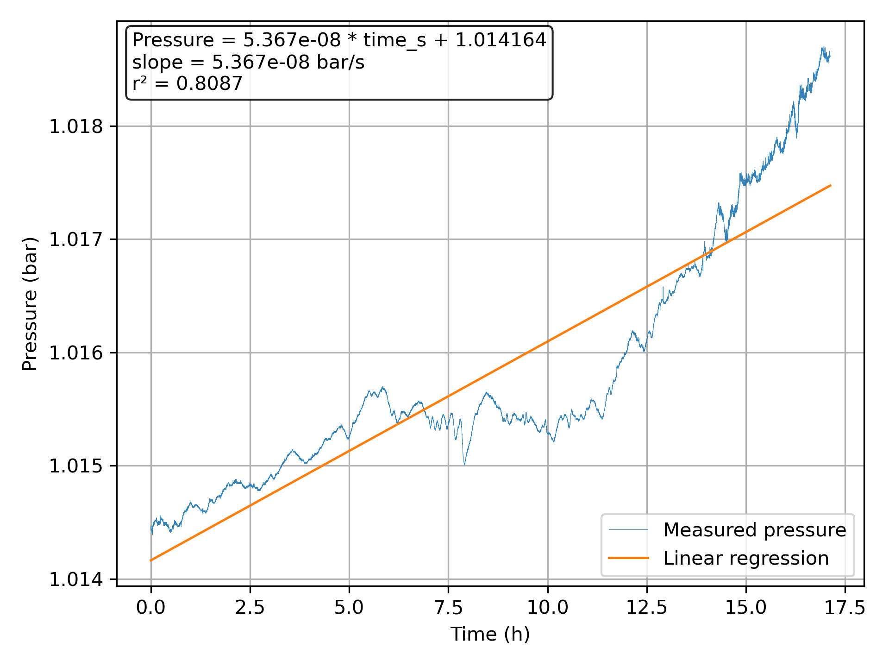

# DPS Logger Example Data

This directory contains a **reference dataset** generated by the DPS Logger.

The files correspond to a single long-duration measurement session:

```
dps_addr01_20260316-173853
```

---

## Files

**CSV**
Raw measurement data recorded by `dps-logger`.

**pressure.png**
Pressure vs time plot.

**hist.png**
Histogram of measured pressure values.

**regression.png**
Linear regression of pressure vs time.

**stats.txt**
Summary statistics, confidence interval, and regression results.

**dps_run_20260316-173853.json**
Logger configuration and metadata for the measurement session.

---

## Measurement summary

* Sensor address: 1

* Samples: 61640

* Interval: 1 s

* Duration: ~17.1 h

* Mean pressure: ~1.0158 bar

* Standard deviation: ~1.06e-03 bar

---

## Plots

### Pressure vs time



### Histogram



### Linear regression



---

## Notes

This dataset demonstrates:

* long-duration pressure monitoring
* small linear drift over time
* short-term fluctuations around a stable mean
* realistic atmospheric pressure variation

The example includes both raw data and derived analysis outputs,
making it suitable for testing and demonstrating `dps-plot`.
