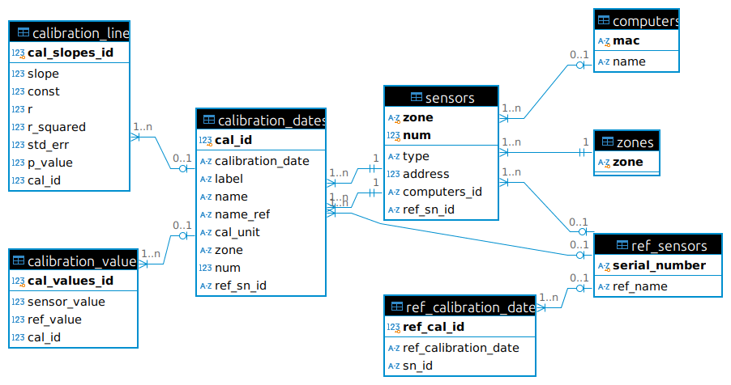
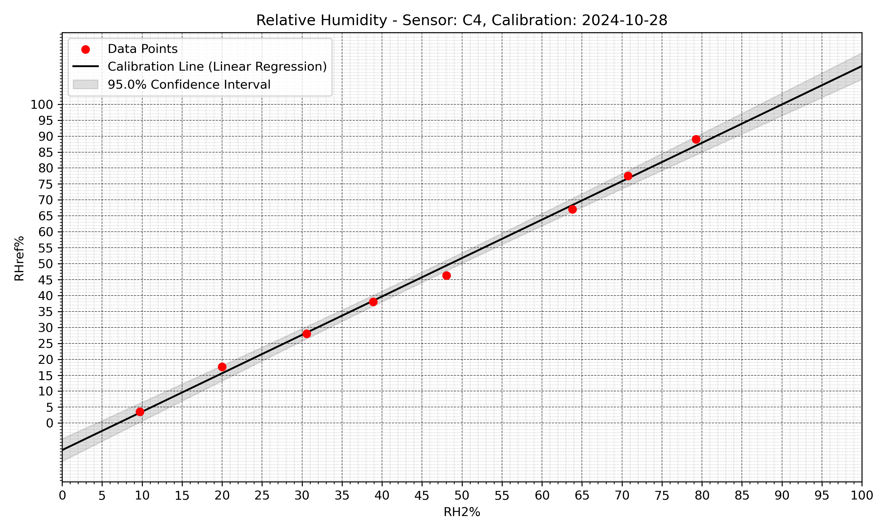

# THP Calibration Program
#### Video Demo:  https://youtu.be/PUZ_fvgNIi0
#### Description: Environmental sensor calibration program, primarily intended for relative humidity calibration


## 1. Introduction

Calibration is a critical process in ensuring the accuracy and reliability of environmental sensors used for measuring parameters like relative humidity, temperature, and pressure. The **THP Calibration Program** is designed to provide a robust solution for sensor calibration by leveraging Python and SQLite3. This program operates primarily on Linux-based systems, such as Raspberry Pi OS, and offers a user-friendly interface for managing and calibrating sensors.

By integrating the flexibility of Python with SQLite's lightweight database capabilities, this program provides a structured approach to:
- Define zones for calibration.
- Manage reference and environmental sensors.
- Store calibration data for long-term access.
- Generate calibration graphs and exportable reports.

This solution is particularly suited for environments where precise humidity conditions are created, such as with a humidity generator.

---

## 2. Requirements

- **Operating System**: Linux (e.g., Raspberry Pi OS)
- **Python Version**: 3.11 or later
- **SQLite Version**: 3 or later
- **Hardware**:
  - One or two environmental sensors to be calibrated.
  - One factory-calibrated reference sensor.
  - A controlled environment to determine varying relative humidity percentages.

---

## 3. Modules Used

The program utilizes a combination of standard and non-standard Python modules:

### Non-standard Modules
| Module Name       | Purpose                                                                 |
|--------------------|-------------------------------------------------------------------------|
| `matplotlib`       | To generate calibration graphs.                                        |
| `numpy`            | For numerical computations such as linear regression and data arrays. |
| `pandas`           | To handle CSV files and structured data for calibration.              |
| `scipy`            | To perform statistical computations, including regression analysis.   |

### Standard Modules
| Module Name       | Purpose                                                                 |
|--------------------|-------------------------------------------------------------------------|
| `argparse`         | To handle command-line arguments for program configuration.            |
| `os`               | For file and directory management.                                     |
| `sqlite3`          | To manage the SQLite database for calibration data.                   |
| `datetime`         | For managing and formatting dates and times.                          |
| `re`               | For regex-based string parsing and validation.                        |
| `shutil`           | To manage file backups and copying operations.                        |
| `sys`              | For system-level operations and script execution control.             |

---

## 4. Program Description and Flow

The THP Calibration Program provides an interactive interface that guides users through the calibration process. Below is an overview of the program's key features and workflows:

1. **Initialization**
   - Create or load the calibration database (`calibration.db`).
   - Set up zones, sensors, and reference sensors if not already configured.

2. **Zones and Sensors**
   - Define zones to organize sensors.
   - Add, list, or delete sensors assigned to a specific zone.

3. **Calibration Process**
   - Select a sensor for calibration.
   - Load calibration data from a CSV file.
   - Perform linear regression to determine the calibration curve.
   - Save calibration parameters (e.g. slope, intercept) and data points to the database.

4. **Reference Management**
   - Add and manage reference sensors.
   - Record and update calibration dates for reference sensors.

5. **Data Visualization**
   - Generate calibration graphs with confidence intervals.
   - Export calibration tables in CSV format for external analysis.

6. **Additional Features**
   - Batch process calibration data in CSV files.
   - Merge external databases into the primary database.
   - Backup and restore the database to ensure data integrity.

---

#### Example Output

Below is an example of the program's interactive interface during sensor addition and calibration:

```plaintext
THP Sensor Calibration
Kim Miikki, 2024

Database (calibration.db) created from schema file.

Creating a new zone.
--------------------
Enter zone name (0 = Exit): C
Accept zone name C (Y/N, Default Y: <Enter>): 
Created zone C

Adding iridium into database.

Add a new reference sensor (Y/N, Default Y: <Enter>): 
Enter the S/N (serial number): W2512000
Enter the sensor name: HMP80

Reference sensor:
S/N:  W2512000
Name: HMP80
Add this sensor into database (Y/N, Default Y: <Enter>): 
...
```
---

## 5. Function Documentation

### 5.1 Database Functions

| Function Name                | Arguments                              | Return Type       | Description                                                                 |
|------------------------------|-----------------------------------------|-------------------|-----------------------------------------------------------------------------|
| `initialize_database`        | `db_file: str`, `schema_file: str`     | `tuple`           | Creates or loads the SQLite database and initializes tables if needed.      |
| `insert_calibration_date`    | Calibration metadata                   | `int`             | Inserts a new calibration date into the database.                          |

### 5.2 User Interface Functions

| Function Name                | Arguments                              | Return Type       | Description                                                                 |
|------------------------------|-----------------------------------------|-------------------|-----------------------------------------------------------------------------|
| `database_operations`        | `cursor: sqlite3.Cursor`, `choices`     | `None`            | Displays the database operations sub menu options                          |
| `print_menu`                 | `cursor: sqlite3.Cursor`, `choices`    | `None`            | Displays the main program menu options.                                     |

### 5.3 Data Analysis Functions

| Function Name                | Arguments                              | Return Type       | Description                                                                 |
|------------------------------|-----------------------------------------|-------------------|-----------------------------------------------------------------------------|
| `linear_regression`          | Sensor and reference values            | `tuple`           | Performs linear regression and returns results.                             |
| `generate_calibration_graph` | Calibration parameters                 | `None`            | Generates a calibration graph from sensor and reference values.             |

### 5.4 Helper Functions

This section provides a categorized list of smaller helper functions, detailing their purpose, required arguments, and return types.

#### **5.4.1 Database Helper Functions**

| Function Name                   | Arguments                                              | Return Type       | Description                                                                                               |
|---------------------------------|-------------------------------------------------------|-------------------|-----------------------------------------------------------------------------------------------------------|
| `get_mac`                       | None                                                  | `str`             | Retrieves the MAC address of the current system.                                                         |
| `get_computer_name`             | None                                                  | `str`             | Returns the name of the computer running the program.                                                    |
| `get_last_number_in_zone`       | `cursor: sqlite3.Cursor`, `choices: dict`             | `int` or `None`   | Gets the highest sensor number in the specified zone.                                                    |
| `get_zone_by_mac`               | `cursor: sqlite3.Cursor`, `mac: str`                  | `str` or `None`   | Retrieves the zone associated with a computer MAC address.                                               |
| `list_reference_calibration_dates` | `cursor: sqlite3.Cursor`, `choices: dict`             | `None`            | Lists all calibration dates for a selected reference sensor.                                             |

#### **5.4.2 String and Input Validation Helpers**

| Function Name                   | Arguments                                              | Return Type       | Description                                                                                               |
|---------------------------------|-------------------------------------------------------|-------------------|-----------------------------------------------------------------------------------------------------------|
| `input_yes_no`                  | `question: str`, `default: bool`                      | `bool`               | Prompts the user with a yes/no question and returns their response as a boolean.                       |
| `is_valid_mac`                  | `mac: str`                                            | `bool`               | Validates whether the given string is a valid MAC address.                                             |
| `string_to_datetime`            | `s: str`                                              | `datetime` or `None` | Converts a string to a `datetime` object if the format is valid.                                      |
| `extract_datetime_from_end`     | `s: str`                                              | `datetime` or `None` | Extracts date/time from the and of a string, e.g. from calibration filename stem.                     |

#### **5.4.3 Sensor Data and Regression Helpers**

| Function Name                   | Arguments                                              | Return Type       | Description                                                                                               |
|---------------------------------|-------------------------------------------------------|-------------------|-----------------------------------------------------------------------------------------------------------|
| `extract_values`                | `text: str`                                           | `tuple` or `None` | Extracts the name and unit from a string representing sensor or reference data.                          |
| `linear_regression`             | `sensor_values: np.ndarray`, `ref_values: np.ndarray` | `tuple`           | Performs linear regression and returns regression parameters (e.g., slope, intercept).                   |
| `compute_fitted_xy`             | `slope: float`, `intercept: float`, `xrange: tuple`   | `tuple`           | Computes X and Y values for plotting a regression line.                                                  |
| `ci_for_fitted_xy`              | `xs: np.ndarray`, `ys: np.ndarray`, regression parameters | `tuple`        | Calculates confidence intervals for the regression line.                                                 |

#### **5.4.4 Zone and Sensor Management Helpers**

| Function Name                   | Arguments                                              | Return Type       | Description                                                                                               |
|---------------------------------|-------------------------------------------------------|-------------------|-----------------------------------------------------------------------------------------------------------|
| `add_zone`                      | `cursor: sqlite3.Cursor`, `choices: dict`             | `None`            | Prompts the user to add a new zone and updates the database.                                              |
| `select_zone`                   | `cursor: sqlite3.Cursor`, `choices: dict`             | `None`            | Allows the user to select a zone and updates the program's current state.                                 |
| `assign_computer_to_sensor`     | `cursor: sqlite3.Cursor`, `choices: dict`             | `None`            | Assigns a computer to a sensor in the database.                                                          |

#### **5.4.5 User Interface Helpers**

| Function Name                   | Arguments                                              | Return Type       | Description                                                                                               |
|---------------------------------|-------------------------------------------------------|-------------------|-----------------------------------------------------------------------------------------------------------|
| `print_menu`                    | `cursor: sqlite3.Cursor`, `choices: dict`             | `None`            | Displays the program's main menu options.                                                                |
| `prompt_str`                    | `choices: dict`                                       | `str`             | Returns a formatted prompt string for the current program state.                                         |
| `list_computers_in_zone`        | `cursor: sqlite3.Cursor`, `choices: dict`             | `None`            | Lists all computers assigned to a specific zone.                                                         |

#### **5.6.6 Miscellaneous Helpers**

| Function Name                   | Arguments                                              | Return Type       | Description                                                                                               |
|---------------------------------|-------------------------------------------------------|-------------------|-----------------------------------------------------------------------------------------------------------|
| `backup_db`                     | `cursor: sqlite3.Cursor`, `choices: dict`             | `None`            | Creates a backup of the database in the current working directory.                                       |
| `merge_db`                      | `cursor: sqlite3.Cursor`                              | `None`            | Merges another SQLite database file into the current database.                                           |
| `delete_db`                     | `cursor: sqlite3.Cursor`, `choices: dict`             | `None`            | Deletes the current database file (after prompting for confirmation).                                    |


## 6. Database Design

The THP Calibration Program uses a relational database to store all calibration-related data, including zones, sensors, reference sensors, calibration results, and more.

### Database Schema Overview

#### **Entity-Relationship Diagram**


#### **Tables**
1. **Zones**: Manages zones used to group sensors.
2. **Sensors**: Stores sensor metadata like type, address, and zone.
3. **Reference Sensors**: Contains details of factory-calibrated sensors.
4. **Calibration Dates**: Tracks calibration sessions.
5. **Calibration Values**: Stores raw calibration data points.
6. **Calibration Line**: Holds regression parameters for calibration.

---

## 7. Graphical Analysis

Below is an example of a calibration graph generated by the program. This graph shows the relationship between sensor readings and reference values for a specific calibration session.


